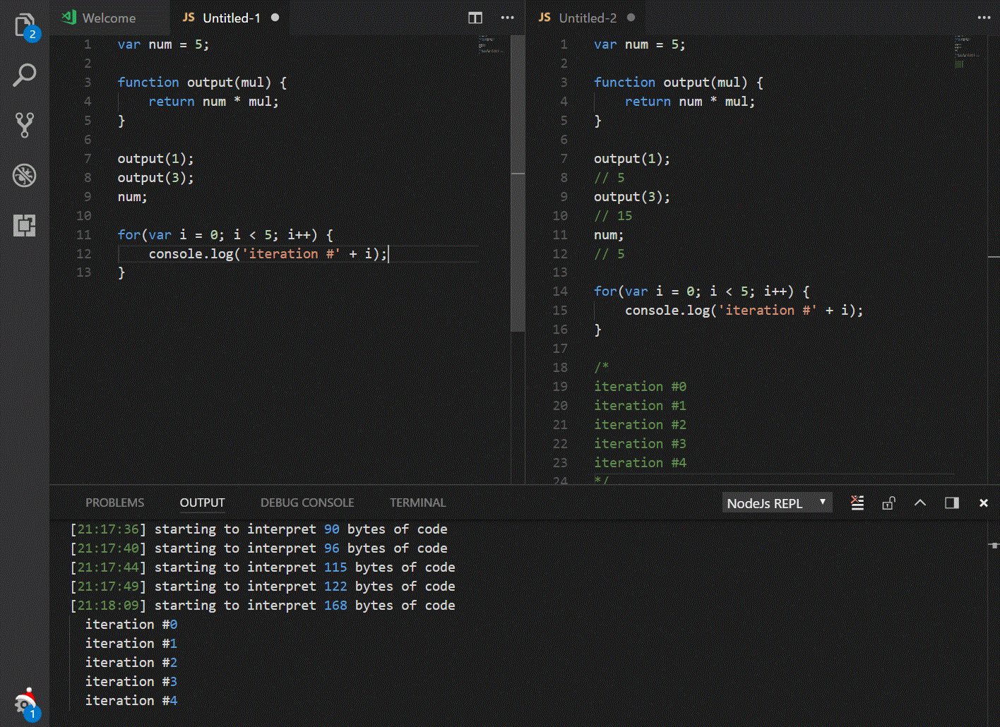

# Node.js Interactive window (REPL)

Node.js Interactive Window (REPL) for Visual Studio Code using Node.js command line right in your favorite IDE. Simply press CTRL + SHIFT + P and launch "Node.js Interactive window (REPL)". 

## Features

Both "return" values and console.log is supported, just as in Node.js REPL since that is used behind the scenes.

## Requirements

This extension requires Node.js v6+

## Known Issues

None at the moment, but this is a preview so please report any bugs 

## Release Notes

### 0.3.1
- Only single window with support for console, result and error

### 0.2.3

- Experimenting with single window instead of split window

### 0.2.0

- Rewrite for import to require, to support Node.js v6+
- Parsing when semicolon or new line is typed
- Autoparsing after 2s after inactivity

### 0.1.0

- Initial release